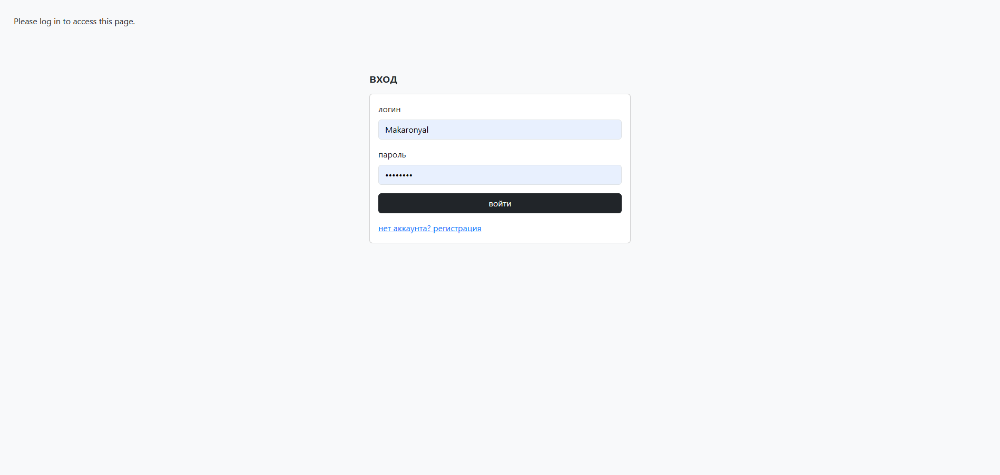
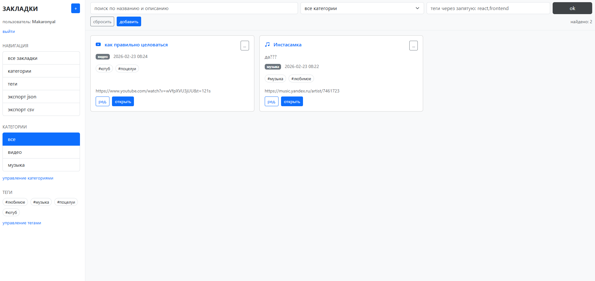
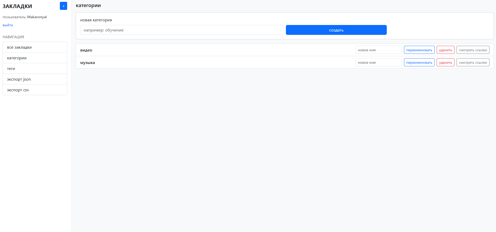
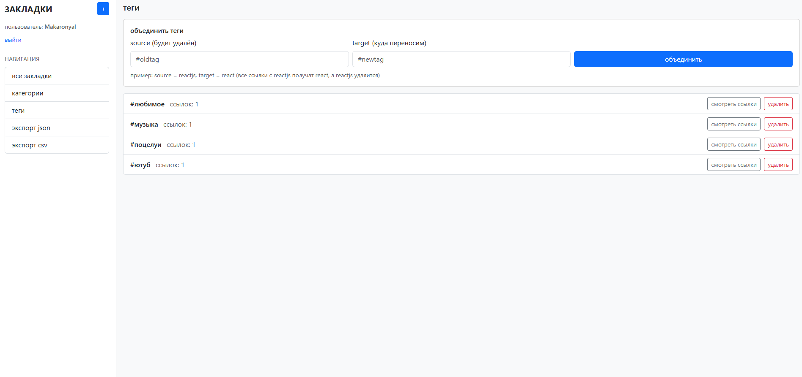

# Bookmark Manager

**Крутой персональный менеджер закладок**  
Удобный, мощный и красивый веб-интерфейс для хранения, поиска и организации ваших ссылок. Полностью на русском, с душой и без лишней воды.

 
 
 


---

## Почему именно этот менеджер закладок?

- Безопасность — хеширование паролей, изоляция данных каждого пользователя
- Категории + Теги — мощная организация с возможностью объединения тегов
- Умный поиск — по названию/описанию + фильтры по категории и тегам (логика AND)
- Красивый UI — Bootstrap 5 + Bootstrap Icons, адаптивный дизайн
- Молниеносный запуск — специальный run.cmd для Windows (всё в одном меню)
- Экспорт в 1 клик — JSON и CSV
- Теги на лету — создаются автоматически при добавлении ссылок
- Удобный интерфейс — сайдбар, быстрые действия, всплывающие уведомления

---

## Технологический стек

| Компонент          | Технология                          |
|--------------------|-------------------------------------|
| Backend            | Flask 3.1 + Flask-SQLAlchemy + Flask-Login |
| База данных        | SQLite (файл instance/bookmarks.db) |
| Frontend           | Bootstrap 5 + Bootstrap Icons + Jinja2 |
| Аутентификация     | Werkzeug (хеши паролей)             |
| Конфигурация       | python-dotenv                       |
| Продакшен          | Gunicorn (готов к деплою)           |

---

## Быстрый старт

### Для Windows (самый простой способ)

1. Распакуй архив bookmarks-main.zip
2. Запусти файл run.cmd
3. В меню выбери по порядку:
   - 2 → создать виртуальное окружение
   - 3 → установить зависимости
   - 4 → создать .env (рекомендуется)
   - 1 → запустить приложение

Готово! Сайт автоматически откроется в браузере:  
**http://127.0.0.1:5000**

### Linux / macOS / Универсально

```bash
# 1. Перейди в папку проекта
cd bookmark_manager

# 2. Создай виртуальное окружение
python -m venv .venv
source .venv/bin/activate          # Windows: .venv\Scripts\activate

# 3. Установи зависимости
pip install -r requirements.txt

# 4. Создай .env (опционально, но желательно)
echo "SECRET_KEY=твой_супер_секрет_$(date +%s)" > .env
echo "FLASK_DEBUG=1" >> .env

# 5. Запусти!
python app.py
```

Открой в браузере: **http://127.0.0.1:5000**

---

## Как пользоваться

### 1. Регистрация / Вход
- Придумай логин и пароль (пароль хешируется, не хранится в открытом виде)

### 2. Добавление новой ссылки (/links/new)
- URL и Название — обязательно
- Описание — опционально
- Категория — выбери одну (или оставь без категории)
- Значок — выбери из 12 красивых Bootstrap Icons
- Теги — пиши через пробел или запятую: #react #frontend python

### 3. Просмотр и фильтрация (/links)
- Поиск — по названию и описанию
- Сайдбар — быстрый фильтр по категориям и тегам
- Множественные теги — выбирай несколько, работает по принципу "И" (AND)
- Клик по ссылке → открыть в новой вкладке

### 4. Управление категориями (/categories)
- Создание, переименование, удаление
- При удалении категории ссылки остаются (категория просто сбрасывается)

### 5. Управление тегами (/tags)
- Удаление тега (удаляется из всех ссылок)
- Объединение тегов — например, reactjs → react (все ссылки получат новый тег, старый удалится)

### 6. Экспорт данных
- JSON — /export/json (полная структура + теги + категории)
- CSV — /export/csv (удобно для Excel/Google Sheets)

---

## Структура проекта

```
bookmarks-main/
├── bookmark_manager/              # основная папка приложения
│   ├── app.py                     # главный Flask-приложение (роуты, логика)
│   ├── models.py                  # SQLAlchemy модели (User, Link, Category, Tag)
│   ├── requirements.txt           # зависимости
│   ├── run.cmd                    # удобный Windows-лаунчер с меню
│   ├── instance/
│   │   └── bookmarks.db           # база данных SQLite (создаётся автоматически)
│   └── templates/                 # Jinja2-шаблоны
│       ├── base.html              # общий layout + навигация
│       ├── links_list.html        # список закладок + фильтры
│       ├── link_form.html         # форма добавления/редактирования
│       ├── categories.html        # управление категориями
│       ├── tags.html              # управление тегами + объединение
│       ├── login.html
│       └── register.html
├── LICENSE
└── README.md                      # ты сейчас его читаешь :)
```

---

## Скриншоты интерфейса

### Страница входа


### Главная страница (список закладок)


### Управление категориями


### Управление тегами


---

## Планы на будущее (roadmap)

- [ ] Тёмная тема
- [ ] Импорт закладок из браузера (HTML/JSON)
- [ ] Папки внутри категорий
- [ ] Поиск по содержимому страницы (через headless browser)
- [ ] Мобильное приложение (PWA)
- [ ] Синхронизация между устройствами

---

## Лицензия

**MIT License** © 2026 Arhydemon

Полный текст лицензии в файле [LICENSE](LICENSE).

---

## Спасибо!

Если проект понравился — поставь звезду на GitHub!

Сделано с любовью к порядку в закладках и чистому коду.

**Автор:** Arhydemon  
**Год:** 2026

